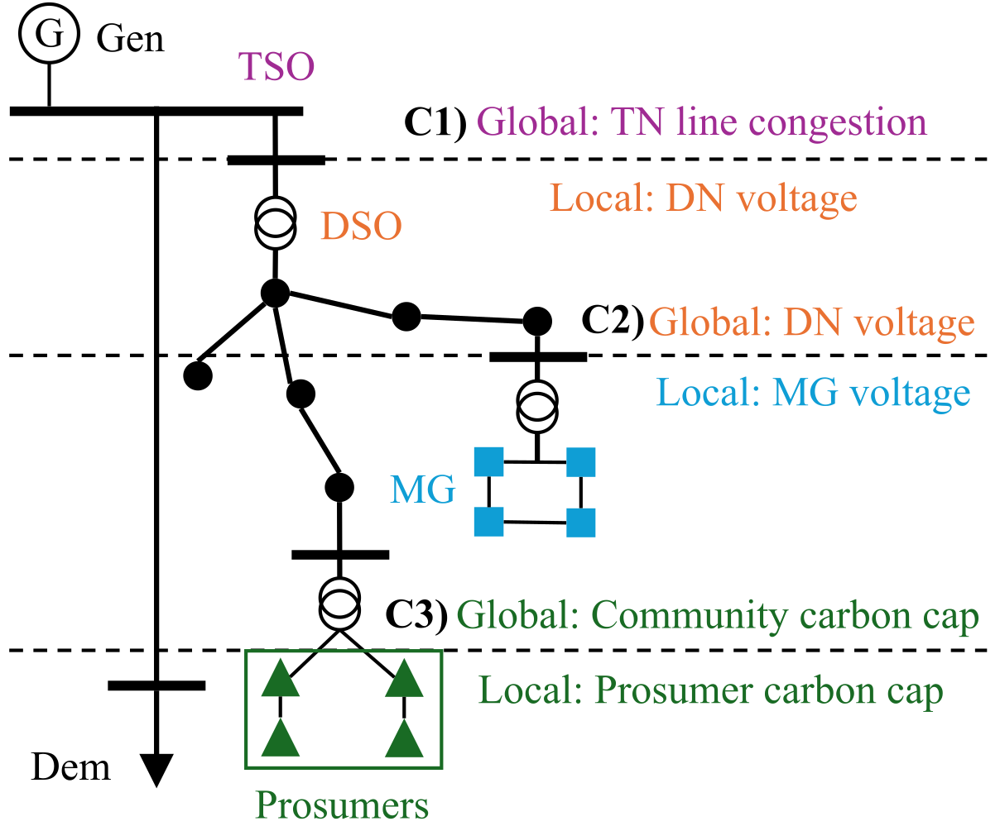
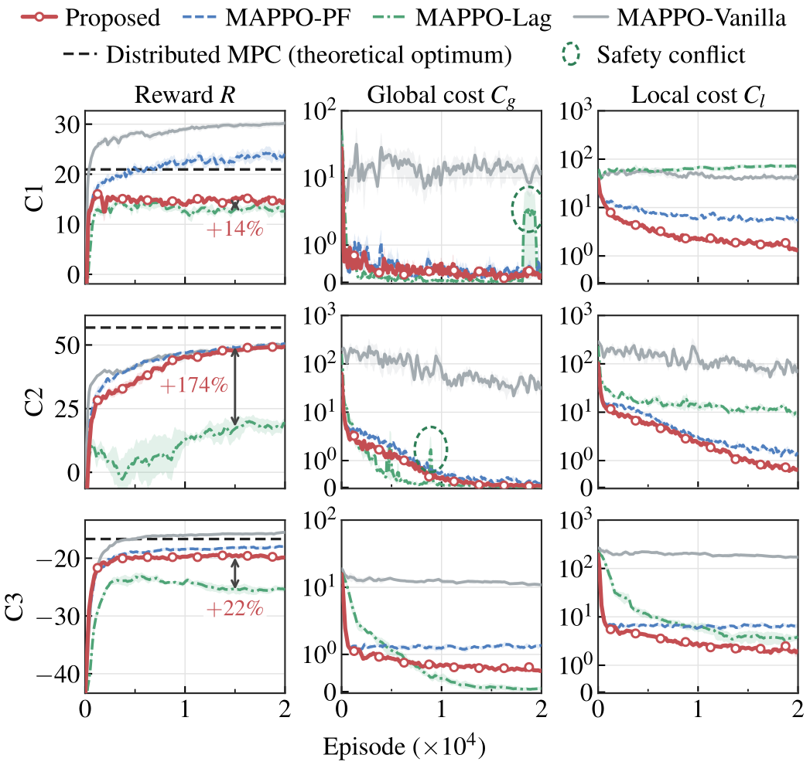

<h1 align="center">Learning to Coordinate Local and Global Operational Constraints<br>in Decentralized Power Systems</h1>

<p align="center">
  
  
  
  
</p>

<p align="center">
  <a href="#overview">Overview</a> •
  <a href="#method">Method</a> •
  <a href="#environments">Environments</a> •
  <a href="#algorithms">Algorithms</a> •
  <a href="#results">Results</a> •
  <a href="#installation">Installation</a> •
  <a href="#quick-start">Quick start</a> •
  <a href="#training">Training</a> •
  <a href="#reproducing-the-paper">Reproduction</a> •
  <a href="#experimental-details">Details</a>
</p>

Code, environments and trained policies for the paper *Learning to Coordinate Local and Global
Operational Constraints in Decentralized Power Systems*.

<p align="center">
  
  <br><em>Figure 1. Decentralized power systems with local and global operational constraints.</em>
</p>

## Overview

Decentralized power systems are operated by many agents, such as DSOs, microgrids and prosumers. Each
agent has local constraints on its own operation (e.g. microgrid voltages or a prosumer's carbon budget).
All agents also share global constraints that couple them (e.g. transmission import limits, network
voltages or a community carbon cap).

The paper models this setting as a constrained Markov game with local and global constraints (CMG-LG):
every agent has its own local cost $`c_i^{\ell}`$, and all agents share a global cost $`c^{g}`$. The proposed
method assigns a local Lagrange multiplier $`\lambda_i^{\ell}`$ to each agent and one shared multiplier
$`\lambda^{g}`$ to the global constraint. Both multipliers enter one hybrid advantage
$`A_h=A_r-\sum_i\lambda_i^{\ell}A_{i,\ell}-\lambda^{g}A_g`$. The hybrid advantage is decomposed into
sequential marginal contributions, so each agent updates its own policy from its local feasibility and its
marginal effect on the global constraint. During execution, each agent acts on its own observation. One
decision of all agents takes $`6\times10^{-4}`$ s and needs no inter-agent communication ([Results](#results)).

## Method

<p align="center"></p>

[docs/algorithm.md](docs/algorithm.md) gives the formulation and maps each line of Algorithm 1 to the code.

## Environments

[`power_envs/`](power_envs) contains three multi-agent power-system environments with local and global
operational constraints. Power flows are solved with pandapower.

| Case | Agents | Local constraint (per agent) | Global constraint (shared) | Obs. / act. dim. |
|---|---|---|---|---|
| C1: TSO-DSO coordination | 3 DSOs (IEEE 33-bus feeders) under an IEEE 30-bus transmission system | DSO bus voltages in [0.95, 1.05] p.u. | total TSO→DSO import ≤ 8 MW | 8 / 4 |
| C2: microgrids in a distribution network | 5 microgrids (7-bus) in an IEEE 33-bus network | microgrid bus voltages in [0.95, 1.05] p.u. | network bus voltages in [0.95, 1.05] p.u. | 8 / 4 |
| C3: prosumer energy community | 12 prosumers (PV, battery, gas DG, flexible load, EV) | prosumer daily carbon cap | community daily carbon cap | 11 / 5 |

Each episode is one day of 24 hourly decisions with stochastic load and PV.
[docs/environments.md](docs/environments.md) defines the observations, actions, transitions, rewards, local
and global costs, parameters and operation problem of each case.

```python
import numpy as np
from power_envs import CASES

np.random.seed(0)
env = CASES["C1"]()
obs = env.reset()
for t in range(24):
    actions = {i: np.random.rand(env.act_dim) for i in env.agent_ids}
    obs, rewards, done, info = env.step(actions)
print(info["dso_voltage_violations"], info["line_overload"])   # local and global costs
```

## Algorithms

The repository contains four multi-agent reinforcement learning methods and two model-based baselines.
The learning methods are based on MAPPO, and each agent acts on its own local observation online.

| Algorithm | Type | Local constraints | Global constraints | Online communication | Code |
|---|---|---|---|---|---|
| Proposed | safe MARL | one multiplier $`\lambda_i^{\ell}`$ per agent | one shared multiplier $`\lambda^{g}`$ | not required | [`safe_marl/`](safe_marl) |
| MAPPO-PF | safe MARL | fixed penalty | fixed penalty | not required | [`safe_marl/`](safe_marl) |
| MAPPO-Lag | safe MARL | one multiplier $`\lambda`$ | one multiplier $`\lambda`$ | not required | [`mappo_lag/`](mappo_lag) |
| MAPPO-Vanilla | MARL | not penalized | not penalized | not required | [`safe_marl/`](safe_marl) |
| Decentralized MPC | model-based | in each agent's model | not modeled | not required | [`baselines/`](baselines) |
| Distributed MPC (ADMM) | model-based | in each agent's model | coordinated by ADMM | required | [`baselines/`](baselines) |

[docs/algorithm.md](docs/algorithm.md) describes the proposed method, and [docs/baselines.md](docs/baselines.md)
describes the MPC baselines.

## Results

All methods are tested online on 20 days with unseen load and PV realizations. The RL policies act
deterministically, and each RL entry is the mean over five training seeds. $`\bar R`$: daily reward;
$`C_g`$/$`C_l`$: daily global/local cost; $`N_v`$: hours per day with $`C_g>0`$ or $`C_l>0`$ in C1/C2/C3; $`t`$:
computation time per decision for all agents, largest of the three cases. Bold: lowest $`C_g`$, $`C_l`$ and
$`N_v`$ among the safe MARL methods.

| Method | C1 $`\bar R`$ | C1 $`C_g`$ | C1 $`C_l`$ | C2 $`\bar R`$ | C2 $`C_g`$ | C2 $`C_l`$ | C3 $`\bar R`$ | C3 $`C_g`$ | C3 $`C_l`$ | $`N_v`$ (h/d) | $`t`$ (s) | Online communication |
|---|---:|---:|---:|---:|---:|---:|---:|---:|---:|:---:|---:|:---:|
| Proposed | 15.4 | **0.08** | **1.18** | 50.5 | 0.03 | **0.44** | −19.7 | 0.53 | **1.92** | **18/17/3** | 6×10⁻⁴ | not required |
| MAPPO-PF | 24.2 | 0.82 | 6.39 | 51.2 | 0.04 | 0.82 | −17.7 | 1.38 | 7.12 | 21/18/4 | 6×10⁻⁴ | not required |
| MAPPO-Lag | 13.0 | 0.26 | 73.9 | 19.2 | **0.003** | 8.05 | −25.3 | **0.05** | 3.81 | 24/23/4 | 6×10⁻⁴ | not required |
| MAPPO-Vanilla | 30.9 | 13.4 | 48.5 | 52.1 | 21.5 | 52.5 | −15.1 | 11.9 | 180 | 23/22/20 | 6×10⁻⁴ | not required |
| Decentralized MPC | 21.7 | 23.1 | 0.007 | 19.3 | 456 | 314 | −15.5 | 0.47 | 0.26 | 8/24/2 | 0.4 | not required |
| Distributed MPC (ADMM) | 21.0 | – | – | 56.8 | – | – | −16.7 | – | – | – | 14 | required (16 to 33 rounds per decision) |

–: enforced as constraints in the MPC model (replayed daily costs ≤ 0.12). The distributed MPC time includes
all ADMM iterations. [docs/baselines.md](docs/baselines.md) describes the MPC baselines, and
[`results/paper/`](results/paper) holds the per-seed and per-day values.

<p align="center">
  
  <br><em>Figure 2. Training results of reward and constraint costs across three cases. Lines: mean over five
  training seeds; shaded: ±1 standard error; costs on a symmetric log scale (linear below 1). Dashed line: daily
  reward of distributed MPC on the 20 test days. Arrows: reward improvement of Proposed over MAPPO-Lag in
  percent, mean of the last 2,000 episodes.</em>
</p>

## Installation

```bash
git clone https://github.com/xiaosly/masafe-power-coordination.git
cd masafe-power-coordination
conda create -n masafe python=3.9 -y && conda activate masafe
pip install -r requirements.txt
```

The MPC baselines need [Gurobi](https://www.gurobi.com) (`pip install gurobipy` and a license; free for
academic use).

## Quick start

The trained policies of the proposed method (3 cases × 5 seeds) are attached to the
[release](https://github.com/xiaosly/masafe-power-coordination/releases):

```bash
bash scripts/download_weights.sh     # -> pretrained/proposed/C{1,2,3}/seed{1..5}/
python -m evaluation.evaluate_rl --case C1 --model_dir pretrained/proposed/C1/seed1
```

The second command prints the results of the 20 test days and their mean (seed 1 in C1: daily reward
16.17, $`C_g`$ = 0.000, $`C_l`$ = 0.94).

## Training

```bash
python -m safe_marl.train --case C1 --seed 1      # one case and seed
python -m safe_marl.train --case C1 --method mappo_pf --seed 1
python -m mappo_lag.train --case C1 --seed 1       # MAPPO-Lag
python scripts/train_all.py                      # four methods, C1-C3, seeds 1-5
```

Proposed, MAPPO-PF and MAPPO-Vanilla are trained with [`safe_marl/`](safe_marl), which uses the network and
rollout components in [`mappo_lagrangian/`](mappo_lagrangian). MAPPO-Lag has its own trainer in
[`mappo_lag/`](mappo_lag). [docs/experiments.md](docs/experiments.md) lists the settings of both trainers.

Each run writes its configuration, training curves (`training_metrics_<case>.mat`),
TensorBoard logs and actor checkpoints to `results/runs/<case>/<method>/seed<k>/`.
Use `--methods proposed mappo_pf mappo_lag mappo_vanilla` to select methods in the batch scripts.

## Reproducing the paper

| Step | Command |
|---|---|
| Training (4 methods × 3 cases × 5 seeds) | `python scripts/train_all.py` |
| Evaluation of all four methods on the 20 test days | `python scripts/evaluate_all.py` |
| Evaluation of the released Proposed policies | `python scripts/evaluate_all.py --pretrained` |
| Decentralized and distributed MPC | `python scripts/evaluate_all.py --mpc-only` |
| Table I | `python scripts/make_table.py` (`--paper` for the results of the paper) |
| Four-method training curves from new runs | `python scripts/plot_training_curves.py` |
| Download the archived training curves | `bash scripts/download_curves.sh` |
| Figure 2 from the archived paper runs | `python scripts/plot_training_curves.py --paper` |

The `masafe_training_curves.zip` release asset contains the complete reward and constraint-cost curves
of all 60 runs (4 methods × 3 cases × 5 seeds). The download command extracts them to
`results/paper/training_curves.npz`. The MPC reward reference comes from the
20 test days in [`mpc_per_day.csv`](results/paper/mpc_per_day.csv).

## Experimental details

| | |
|---|---|
| Observations / actions | local observation of 8, 8, 11 features; 4, 4, 5 continuous set-points in [0, 1] |
| Episode | 24 hourly steps (one day); load and PV multipliers $`\mathcal{N}(1,0.05^2)`$ i.i.d. per hour |
| Reward and cost scaling | reward 0.003 (C1) / 0.008 (C2, C3) per $; squared voltage violation × 100, squared import excess (MW²), relative carbon excess × 5 |
| Networks | per agent: actor and three critics (reward, global cost, local cost), 3 × 256 ReLU layers with LayerNorm; reward and global-cost critics take all agents' observations |
| Optimization | Adam, learning rate 3e-4 (actor) / 5e-4 (critics); PPO clip 0.2, 5 epochs, batch 96; $`\gamma`$ = 0.99, GAE 0.95; entropy 0.008; PopArt |
| Multipliers | $`\eta_\lambda`$ = 5e-4, $`\lambda^{\ell}_0`$ = 0.5, $`\lambda^{g}_0`$ = 0.78, $`d^{\ell}=d^{g}=0`$ |
| Seeds and budget | 5 training seeds; 480,096 environment steps (20,004 days) per run; 20 test days |

These are the settings of Proposed. [docs/experiments.md](docs/experiments.md) lists the settings of all
methods.

## Repository structure

```text
power_envs/          C1, C2, C3 environments
safe_marl/           Proposed, MAPPO-PF and MAPPO-Vanilla training
mappo_lag/           MAPPO-Lag training implementation and train.py
mappo_lagrangian/    network, policy, buffer and rollout components for safe_marl
evaluation/          test-day evaluation and deterministic policies
baselines/           decentralized and distributed (ADMM) MPC
scripts/             weights and curves download, training, evaluation, Table I, training curves
results/paper/       Table I results; downloaded Figure 2 curves
docs/                environments, algorithm, experimental settings, MPC baselines
tests/               unit tests (python -m pytest tests)
```

## License

[MIT License](LICENSE). The MAPPO-L components in `mappo_lagrangian/` and `mappo_lag/core/` are adapted from
[MACPO](https://github.com/chauncygu/Multi-Agent-Constrained-Policy-Optimisation) and
[MAPPO](https://github.com/marlbenchmark/on-policy) ([THIRD_PARTY_NOTICES.md](THIRD_PARTY_NOTICES.md)).
