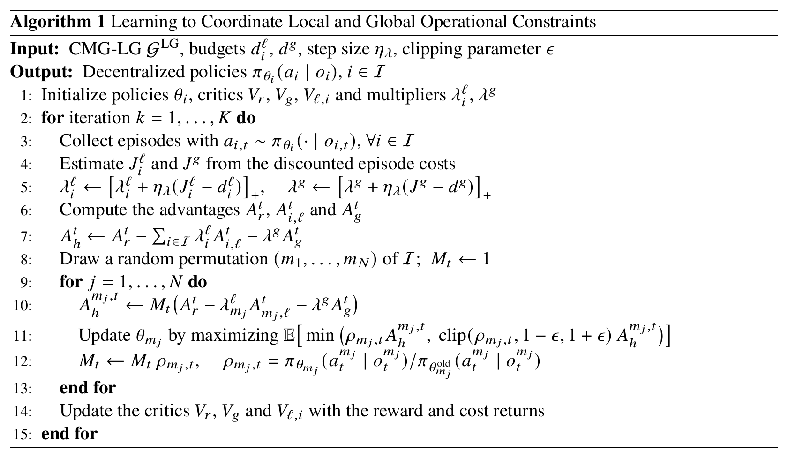

# Algorithm

<p align="center"></p>

## Formulation

With the CMG-LG model of [environments.md](environments.md), the policies maximize the expected
discounted reward $`J_r(\boldsymbol\pi)`$ subject to one constraint per agent on its local cost and one
constraint on the shared global cost:

```math
J_i^{\ell}(\boldsymbol\pi)=\mathbb{E}\Big[\sum_{t}\gamma^t c_i^{\ell}(s_t,\mathbf{a}_t)\Big]\le d_i^{\ell}\ \ \forall i\in\mathcal{I},\qquad
J^{g}(\boldsymbol\pi)=\mathbb{E}\Big[\sum_{t}\gamma^t c^{g}(s_t,\mathbf{a}_t)\Big]\le d^{g}.
```

Lagrangian relaxation with separate local and global multipliers:

```math
\max_{\boldsymbol\pi}\ \min_{\boldsymbol\lambda^{\ell}\succeq 0,\ \lambda^{g}\ge 0}\
J_r(\boldsymbol\pi)-\sum_{i\in\mathcal{I}}\lambda_i^{\ell}\big(J_i^{\ell}(\boldsymbol\pi)-d_i^{\ell}\big)-\lambda^{g}\big(J^{g}(\boldsymbol\pi)-d^{g}\big),
```

```math
\lambda_i^{\ell}\leftarrow\big[\lambda_i^{\ell}+\eta_\lambda\,(J_i^{\ell}-d_i^{\ell})\big]_+,\qquad
\lambda^{g}\leftarrow\big[\lambda^{g}+\eta_\lambda\,(J^{g}-d^{g})\big]_+ .
```

Hybrid advantage:

```math
A_h^t=A_r^t-\sum_{i\in\mathcal{I}}\lambda_i^{\ell}A_{i,\ell}^t-\lambda^{g}A_g^t .
```

Agent-wise decomposition along a random permutation $`(m_1,\dots,m_N)`$:

```math
A_h^t=\sum_{j=1}^{N}A_h^{m_j,t},\qquad A_h^{m_j,t}=Q_h^{m_{1:j},t}-Q_h^{m_{1:j-1},t},
```

estimated with the probability ratios of the agents updated before $`m_j`$:

```math
\hat A_h^{m_j,t}=M_t\big(\hat A_r^t-\lambda_{m_j}^{\ell}\hat A_{m_j,\ell}^t-\lambda^{g}\hat A_g^t\big),\qquad
M_t=\prod_{k<j}\rho_{m_k,t},\qquad
\rho_{m_j,t}=\frac{\pi_{\theta_{m_j}}(a_t^{m_j}\mid o_t^{m_j})}{\pi_{\theta^{\mathrm{old}}_{m_j}}(a_t^{m_j}\mid o_t^{m_j})}.
```

Clipped surrogate of agent $`m_j`$:

```math
\mathcal{J}_{m_j}=\mathbb{E}\Big[\min\big(\rho_{m_j,t}A_h^{m_j,t},\ \mathrm{clip}(\rho_{m_j,t},1-\epsilon,1+\epsilon)\,A_h^{m_j,t}\big)\Big].
```

Training is centralized: each agent's reward and global-cost critics take the observations of all agents;
its local-cost critic takes its own observation. Each reward critic fits the reward returned to that
agent by the environment. Execution is decentralized: each agent acts on its own observation.

## Code

| Algorithm 1 | Code |
|---|---|
| Lines 3 to 5: rollouts and multiplier updates | [`safe_marl/runner.py`](../safe_marl/runner.py) `LocalGlobalRunner.run`, [`safe_marl/trainer.py`](../safe_marl/trainer.py) `update_duals` |
| Lines 6 and 7: advantages and hybrid advantage | `LocalGlobalRunner.compute`, `LocalGlobalTrainer.train` |
| Lines 8 to 13: sequential agent updates | `LocalGlobalRunner.train`, `LocalGlobalTrainer.ppo_update` |
| Line 14: critics | `LocalGlobalTrainer.ppo_update` |
| Networks, buffer, rollout workers | [`mappo_lagrangian/`](../mappo_lagrangian) |
